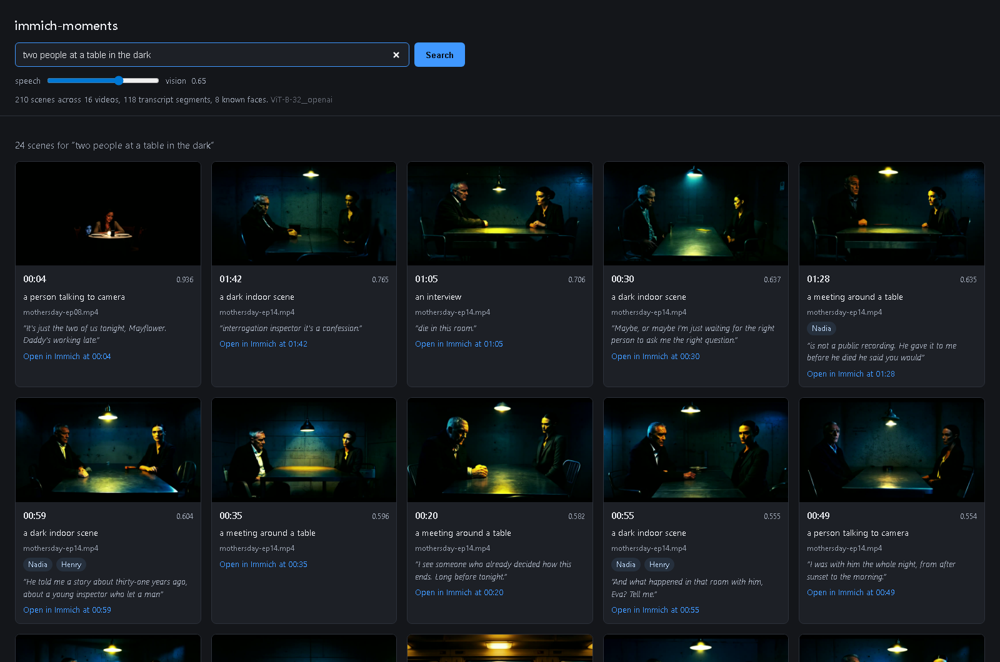

# immich-moments

Immich's own FAQ is straight about where video search stops:

> Immich's machine learning feature operates on the generated thumbnail. If a face is visible
> in the video's thumbnail it will be picked up by facial recognition.

One frame per video. A fourteen minute birthday tape is one thumbnail, so the moment someone
blows out the candles is not findable, and neither is anything anybody said.

immich-moments indexes the inside of your videos. It splits each one into scenes, embeds a
frame from each scene with the same CLIP model your Immich already runs, matches faces against
the people you have already named in Immich, transcribes the audio with Whisper, and puts it
all behind one search box.

It talks to Immich over the public REST API. No fork, no Postgres access, no re-encoding, and
nothing leaves your machine.



## What you get

```
$ immich-moments search "a train moving through the dark" --limit 3
                         3 scene(s) for 'a train moving through the dark'
┌───────┬───────┬─────────────────────┬─────────────────┬────────┬────────────────────────────────┐
│ score │    at │ video               │ scene           │ people │ said                           │
├───────┼───────┼─────────────────────┼─────────────────┼────────┼────────────────────────────────┤
│ 0.943 │ 00:04 │ mothersday-ep11.mp4 │ a train passing │ -      │ You're the first person I've   │
│       │       │                     │                 │        │ seen on this train…            │
│ 0.650 │ 00:46 │ mothersday-ep11.mp4 │ a train passing │ -      │                                │
│ 0.650 │ 01:08 │ mothersday-ep11.mp4 │ a train passing │ -      │                                │
└───────┴───────┴─────────────────────┴─────────────────┴────────┴────────────────────────────────┘
http://localhost:2283/photos/d625e56a-0254-4d24-ac08-d3cf2d297931
```

Each hit is a scene, not a file: a timestamp you can scrub to, the people in it, and the line
that was spoken there. `--person Martin` narrows any search to the scenes he is in,
`--album "Mothers Day 2026"` to the videos in one Immich album, and
`--since 2019-07-01 --until 2019-07-31` to the videos filmed that month. Any of them on its
own lists those scenes newest first, if you have no words to search for. `serve` puts
the same thing in a browser with thumbnails, and every result links back to the asset in
Immich.

Optionally it writes what it found back into Immich, as tags and a fenced block in the asset
description, so the moments are findable from Immich's own search bar too.

## Requirements

- An Immich server (tested against v3.2.2) and an API key
- Immich's machine-learning container reachable on its own port, usually 3003
- ffmpeg and ffprobe on PATH
- Python 3.12 or newer
- A GPU is optional. Whisper on the CPU works, at roughly a fifth of real time on `small`.

## Install

```
pip install immich-moments
```

or without installing anything permanently:

```
uvx immich-moments doctor
```

or next to an existing Immich stack, with
[docker-compose.example.yml](docker-compose.example.yml) copied into the same folder as
Immich's own compose file:

```yaml
services:
  immich-moments:
    image: ghcr.io/booyaka101/immich-moments:1.0.3
    environment:
      IMMICH_URL: http://immich-server:2283
      IMMICH_API_KEY: ${IMMICH_API_KEY}
      IMMICH_ML_URL: http://immich-machine-learning:3003
    volumes:
      - immich-moments-data:/data
    ports:
      - 8099:8099
```

```
docker compose -f docker-compose.yml -f docker-compose.example.yml run --rm immich-moments index
docker compose -f docker-compose.yml -f docker-compose.example.yml up -d immich-moments
```

## Use it

Point it at your server. Make the key in Immich under Account Settings, API Keys.

```
export IMMICH_URL=http://localhost:2283
export IMMICH_API_KEY=...
export IMMICH_ML_URL=http://localhost:3003
```

### doctor

Checks the key, reports which models your server is actually configured with, and pushes a
real image from your own library through `/predict` before you wait on an index run.

```
$ immich-moments doctor
OK  Immich API       http://localhost:2283 (v3.2.2)
OK  CLIP model       ViT-B-32__openai
OK  Face model       buffalo_l
    Face thresholds  minScore 0.7, maxDistance 0.5
OK  Videos visible   16
OK  Named people     8
OK  ML container     http://localhost:3003 answered /ping
OK  CLIP text        512-dim vector
OK  CLIP image       round-tripped Martin's face thumbnail, 512-dim, cosine
                     +0.168 against the probe text
OK  Face pipeline    1 face(s) in Martin's face thumbnail
OK  Index            16 assets, 210 scenes, 118 transcript segments at
                     D:\tmp\moments-fresh\moments.sqlite3
```

Every line is a real request. A failure exits non-zero and says which one. A video the last
run could not index is listed with the reason, so a problem does not vanish when the run
scrolls away:

```
--  Not indexed      rotated_phone_clip.mp4: ffmpeg: moov atom not found
```

### index

```
$ immich-moments index
clip=ViT-B-32__openai (512-dim)  faces=buffalo_l  data=D:\tmp\moments-fresh
visual 1/16  umbra-short.mp4
visual 2/16  rotated_phone_clip.mp4
...
visual 16/16  day12-film.mp4
speech 1/16  umbra-short.mp4
...
speech 16/16  day12-film.mp4
discovered               16
people references        8
albums                   2
videos indexed (visual)  16
videos indexed (speech)  16
scenes                   210
transcript segments      118
no audio track           2
no speech found          5
                  timings
┌──────────┬────────┬─────────┬───────────┐
│ phase    │ assets │ seconds │ per asset │
├──────────┼────────┼─────────┼───────────┤
│ discover │     16 │     0.0 │      0.0s │
│ albums   │      2 │     0.1 │      0.0s │
│ people   │      8 │     1.8 │      0.2s │
│ visual   │     16 │   491.2 │     30.7s │
│ speech   │     16 │    22.0 │      1.4s │
└──────────┴────────┴─────────┴───────────┘
```

In a terminal those per-video lines are a progress bar with a remaining-time estimate instead,
one per phase. Piped or redirected, you get the plain lines above.

Those numbers are a real run over 16 videos, 31 minutes of footage, on an RTX 4090 with
Immich's ML container on the same box. Most of the visual time is downloading originals and
decoding them, not the model.

It checkpoints after every asset, so an interrupted run continues where it stopped.
`--since auto` (the default) only looks at assets added since the last run. `--reindex` throws
the index away and rebuilds it, which is also what a change of CLIP model needs.

Videos you trash in Immich do not leave the index on their own, because `--since auto` never
hears about them. `--prune` walks the whole library instead and drops whatever Immich no
longer has, scenes and transcript included:

```
$ immich-moments index --prune
clip=ViT-B-32__openai (512-dim)  faces=buffalo_l  data=D:\tmp\moments-data
discovered                 15
people references          8
albums                     2
videos indexed (visual)    0
videos indexed (speech)    0
scenes                     0
transcript segments        0
dropped, gone from Immich  rotated_phone_clip.mp4
                  timings
┌──────────┬────────┬─────────┬───────────┐
│ phase    │ assets │ seconds │ per asset │
├──────────┼────────┼─────────┼───────────┤
│ discover │     15 │     0.0 │      0.0s │
│ albums   │      2 │     0.1 │      0.0s │
│ people   │      8 │     1.8 │      0.2s │
│ visual   │      0 │     0.0 │         - │
└──────────┴────────┴─────────┴───────────┘
```

Faces are detected on every scene whether or not anyone is named yet, and the embedding is
kept. Name, rename or merge someone in Immich and the next run puts the new name on the scenes
already indexed. The visual phase does no work, because nothing has to be downloaded or
decoded to do it:

```
$ immich-moments index
clip=ViT-B-32__openai (512-dim)  faces=buffalo_l  data=D:\tmp\moments-data
discovered                   0
people references            8
albums                       2
faces renamed or re-matched  8
videos indexed (visual)      0
videos indexed (speech)      0
scenes                       0
transcript segments          0
                  timings
┌──────────┬────────┬─────────┬───────────┐
│ phase    │ assets │ seconds │ per asset │
├──────────┼────────┼─────────┼───────────┤
│ discover │      0 │     0.0 │         - │
│ albums   │      2 │     0.1 │      0.1s │
│ people   │      8 │     1.7 │      0.2s │
│ visual   │      0 │     0.0 │         - │
└──────────┴────────┴─────────┴───────────┘

$ immich-moments search --person "Martin Selby" --limit 3
                                     3 scene(s) with Martin Selby
┌────────────┬───────┬─────────────────────┬─────────────────────┬──────────────┬─────────────────────┐
│       date │    at │ video               │ scene               │ people       │ said                │
├────────────┼───────┼─────────────────────┼─────────────────────┼──────────────┼─────────────────────┤
│ 2026-06-07 │ 00:05 │ mothersday-ep11.mp4 │ a close up of a     │ Martin Selby │ I got on it Selby.  │
│            │       │                     │ face                │              │ The platform was    │
│            │       │                     │                     │              │ empty.              │
│ 2026-06-07 │ 00:12 │ mothersday-ep11.mp4 │ -                   │ Martin Selby │ My mother put me on │
│            │       │                     │                     │              │ it. She kept        │
│            │       │                     │                     │              │ saying, just k…     │
│ 2026-06-07 │ 00:19 │ mothersday-ep11.mp4 │ a close up of a     │ Martin Selby │ Then it'll be the   │
│            │       │                     │ face                │              │ first to see what's │
│            │       │                     │                     │              │ after it.           │
└────────────┴───────┴─────────────────────┴─────────────────────┴──────────────┴─────────────────────┘
```

Hiding or deleting a person in Immich works the same way in reverse: their name comes off
the scenes on the next run.

### search

```
$ immich-moments search "the drug was pulled off the market" --limit 2
                        2 scene(s) for 'the drug was pulled off the market'
┌───────┬───────┬─────────────────────┬────────────────────────┬────────┬─────────────────────────┐
│ score │    at │ video               │ scene                  │ people │ said                    │
├───────┼───────┼─────────────────────┼────────────────────────┼────────┼─────────────────────────┤
│ 0.350 │ 03:54 │ mothersday-ep09.mp4 │ autumn leaves          │ -      │ Memento was withdrawn   │
│       │       │                     │                        │        │ from the United States  │
│       │       │                     │                        │        │ ma…                     │
│ 0.349 │ 03:18 │ mothersday-ep09.mp4 │ a person smiling at    │ -      │ It's the drug. We all   │
│       │       │                     │ the camera             │        │ know it's the drug.     │
│       │       │                     │                        │        │ Foss,…                  │
└───────┴───────┴─────────────────────┴────────────────────────┴────────┴─────────────────────────┘
http://localhost:2283/photos/21dda574-e4f6-434c-a64f-e1b42ce88ae4

$ immich-moments search "something living behind the wall" --limit 2
                         2 scene(s) for 'something living behind the wall'
┌───────┬───────┬─────────────────────┬────────────────────────┬────────┬─────────────────────────┐
│ score │    at │ video               │ scene                  │ people │ said                    │
├───────┼───────┼─────────────────────┼────────────────────────┼────────┼─────────────────────────┤
│ 0.350 │ 00:40 │ mothersday-ep08.mp4 │ a dark indoor scene    │ -      │ there's something       │
│       │       │                     │                        │        │ behind the wall it's    │
│       │       │                     │                        │        │ been the…               │
│ 0.259 │ 01:52 │ exposure-film.mp4   │ a camera pointing at   │ -      │                         │
│       │       │                     │ the floor              │        │                         │
└───────┴───────┴─────────────────────┴────────────────────────┴────────┴─────────────────────────┘
http://localhost:2283/photos/8ae3a967-18b5-4626-b30c-f92e9ec13e9c
```

Both of those are speech hits at the default weight. The timestamp is where the words were
said when speech decided the hit, and where the cut is when the picture did. `--asset <id>`
searches inside one video.

`--weight` is the blend: 1 is vision only, 0 is speech only, the default is 0.65. Pull it down
towards 0.3 when you want the transcript to decide.

`--person` narrows a search to the scenes someone is in. It is repeatable, and two names mean
both of them in the same scene, not either of them.

```
$ immich-moments search "a train moving through the dark" --person Martin --limit 2
                   2 scene(s) for 'a train moving through the dark' with Martin
┌───────┬───────┬─────────────────────┬─────────────────────┬───────────────┬─────────────────────┐
│ score │    at │ video               │ scene               │ people        │ said                │
├───────┼───────┼─────────────────────┼─────────────────────┼───────────────┼─────────────────────┤
│ 0.408 │ 01:00 │ mothersday-ep11.mp4 │ a bus journey       │ Martin, Elena │ That's a good thing │
│       │       │                     │                     │               │ to remember. What   │
│       │       │                     │                     │               │ about you?          │
│ 0.099 │ 00:08 │ mothersday-ep11.mp4 │ a close up of a     │ Martin        │ I got on it Selby.  │
│       │       │                     │ face                │               │ The platform was    │
│       │       │                     │                     │               │ empty.              │
└───────┴───────┴─────────────────────┴─────────────────────┴───────────────┴─────────────────────┘
http://localhost:2283/photos/d625e56a-0254-4d24-ac08-d3cf2d297931
```

Scores are always relative to the scenes that were searched, so a filtered search rescales
against what the filter left rather than against the whole library.

With `--person` and no query at all there is nothing to rank, so you get that person's scenes
newest video first, and the column that usually holds the score holds the date instead.

```
$ immich-moments search --person Martin --limit 3
                                      3 scene(s) with Martin
┌────────────┬───────┬─────────────────────┬──────────────────────┬────────┬──────────────────────┐
│       date │    at │ video               │ scene                │ people │ said                 │
├────────────┼───────┼─────────────────────┼──────────────────────┼────────┼──────────────────────┤
│ 2026-06-07 │ 00:05 │ mothersday-ep11.mp4 │ a close up of a face │ Martin │ I got on it Selby.   │
│            │       │                     │                      │        │ The platform was     │
│            │       │                     │                      │        │ empty.               │
│ 2026-06-07 │ 00:12 │ mothersday-ep11.mp4 │ -                    │ Martin │ My mother put me on  │
│            │       │                     │                      │        │ it. She kept saying, │
│            │       │                     │                      │        │ just k…              │
│ 2026-06-07 │ 00:19 │ mothersday-ep11.mp4 │ a close up of a face │ Martin │ Then it'll be the    │
│            │       │                     │                      │        │ first to see what's  │
│            │       │                     │                      │        │ after it.            │
└────────────┴───────┴─────────────────────┴──────────────────────┴────────┴──────────────────────┘
http://localhost:2283/photos/d625e56a-0254-4d24-ac08-d3cf2d297931
```

A name that no indexed scene carries is an error naming the people that are indexed, because
a typo otherwise looks exactly like a person who happens to be in no video. The web API answers
the same sentence with a 400, and whatever case you type is resolved to the spelling the index
uses before it reaches the filter.

`--album` narrows a search to the videos in an Immich album. Membership is per video rather
than per scene, and every run reads it back, so a video you move between albums follows on the
next `index`. It is repeatable too, and two albums mean a video that is in both.

```
$ immich-moments search "a train moving through the dark" --album "Mothers Day 2026" --limit 3
               3 scene(s) for 'a train moving through the dark' in Mothers Day 2026                
┌───────┬───────┬─────────────────────┬─────────────────┬────────┬────────────────────────────────┐
│ score │    at │ video               │ scene           │ people │ said                           │
├───────┼───────┼─────────────────────┼─────────────────┼────────┼────────────────────────────────┤
│ 0.971 │ 00:04 │ mothersday-ep11.mp4 │ a train passing │ -      │ You're the first person I've   │
│       │       │                     │                 │        │ seen on this train…            │
│ 0.650 │ 00:46 │ mothersday-ep11.mp4 │ a train passing │ -      │                                │
│ 0.650 │ 01:08 │ mothersday-ep11.mp4 │ a train passing │ -      │                                │
└───────┴───────┴─────────────────────┴─────────────────┴────────┴────────────────────────────────┘
http://localhost:2283/photos/d625e56a-0254-4d24-ac08-d3cf2d297931
```

Albums that hold no video never reach the index, so they are not on offer and an album name
the index does not know is the same error the person filter gives:

```
$ immich-moments search "a train" --album "Holiday 2019"
error: no indexed video is in Holiday 2019. Indexed albums: Mothers Day 2026, Night shoots
```

`--like SCENE_ID` drops the query and ranks by picture alone against one scene you already
found, which is how you get the rest of a moment the words never mention. Scene ids come from
`--json` or the web API. The score is a plain cosine between two scene vectors, not the blended
score a query produces, so the column says so.

```
$ immich-moments search --like 103 --limit 4
                     4 scene(s) like 'a train passing' in mothersday-ep11.mp4                      
┌────────┬───────┬─────────────────────┬────────────────────────┬────────┬────────────────────────┐
│ cosine │    at │ video               │ scene                  │ people │ said                   │
├────────┼───────┼─────────────────────┼────────────────────────┼────────┼────────────────────────┤
│  0.984 │ 01:08 │ mothersday-ep11.mp4 │ a train passing        │ -      │                        │
│  0.844 │ 00:27 │ mothersday-ep11.mp4 │ a train passing        │ -      │                        │
│  0.823 │ 00:21 │ mothersday-ep13.mp4 │ a dark indoor scene    │ -      │                        │
│  0.810 │ 00:49 │ mothersday-ep14.mp4 │ a person talking to    │ -      │ I was with him the     │
│        │       │                     │ camera                 │        │ whole night, from      │
│        │       │                     │                        │        │ after suns…            │
└────────┴───────┴─────────────────────┴────────────────────────┴────────┴────────────────────────┘
http://localhost:2283/photos/d625e56a-0254-4d24-ac08-d3cf2d297931
```

Filters still apply, so `--like 103 --person Martin` is "more of this, but only where Martin is".
In the UI every result card has a "more like this" link that does the same thing.

`--since` and `--until` take a calendar day each, `YYYY-MM-DD`, and keep the videos filmed
between them. Both ends include their own day, and the bound is the capture date Immich holds
for the video, not when it was uploaded. Like the person filter, this runs before either
channel scores anything, so the scores you see are relative to what the range left.

```
$ immich-moments search "a train moving through the dark" --since 2026-06-10 --until 2026-06-16 --limit 3
        3 scene(s) for 'a train moving through the dark' since 2026-06-10 until 2026-06-16         
┌───────┬───────┬─────────────────────┬─────────────────────┬──────────────┬──────────────────────┐
│ score │    at │ video               │ scene               │ people       │ said                 │
├───────┼───────┼─────────────────────┼─────────────────────┼──────────────┼──────────────────────┤
│ 0.404 │ 01:42 │ mothersday-ep14.mp4 │ a dark indoor scene │ -            │ interrogation        │
│       │       │                     │                     │              │ inspector it's a     │
│       │       │                     │                     │              │ confession.          │
│ 0.350 │ 00:59 │ mothersday-ep14.mp4 │ a dark indoor scene │ Nadia, Henry │ He told me a story   │
│       │       │                     │                     │              │ about thirty-one     │
│       │       │                     │                     │              │ years ago, …         │
│ 0.305 │ 01:21 │ night-signals.mp4   │ a nightclub dance   │ -            │                      │
│       │       │                     │ floor               │              │                      │
└───────┴───────┴─────────────────────┴─────────────────────┴──────────────┴──────────────────────┘
http://localhost:2283/photos/dc58afad-2843-4202-91bb-8b0ac95c72c4
```

The train video itself was filmed on 2026-06-07, so the range drops it and the rest of the
library moves up. A range on its own, with no query and nobody named, lists those videos newest
first. In the UI the two date boxes sit next to the who menu and live in the URL with
everything else.

`--json` prints the same hits as the web API does, for piping into something else. `thumb` is
the path `serve` exposes; the file itself is that name under `$DATA_DIR/thumbs`.

```
$ immich-moments search "where did you get that tape" --limit 1 --json
[
  {
    "scene_id": 67,
    "asset_id": "dc58afad-2843-4202-91bb-8b0ac95c72c4",
    "file_name": "mothersday-ep14.mp4",
    "file_created_at": "2026-06-10T12:00:00.000Z",
    "scene_index": 15,
    "start_seconds": 86.29,
    "end_seconds": 91.33,
    "timestamp": "01:26",
    "duration": "00:05",
    "label": "a meeting around a table",
    "people": [
      "Nadia"
    ],
    "transcript": "Where did you get that tape, Eva? is not a public recording. He gave it to me before he died he said you would",
    "score": 0.35,
    "visual_score": 0.2034,
    "text_score": 22.7209,
    "thumb": "/thumbs/dc58afad-2843-4202-91bb-8b0ac95c72c4-0015.jpg",
    "immich_url": "http://localhost:2283/photos/dc58afad-2843-4202-91bb-8b0ac95c72c4"
  }
]
```

### relabel

Scene labels come from a vocabulary, and the right vocabulary for your library is not the one
shipped here. `relabel` tries a new one against the vectors already in the index, so it costs one
embedding pass over the word list rather than another pass over every video.

```
$ immich-moments relabel --dry-run
210 scene(s) with vectors, 209 labelled, 1 below the threshold
0 change(s): 0 newly labelled, 0 cleared, 0 moved to another label
--dry-run: nothing written.

$ immich-moments relabel --labels smaller.txt --dry-run
210 scene(s) with vectors, 168 labelled, 42 below the threshold
209 change(s): 0 newly labelled, 41 cleared, 168 moved to another label
                  first changes                   
┌────────────────────────┬───────────────┬───────┐
│ was                    │ now           │ score │
├────────────────────────┼───────────────┼───────┤
│ a black screen         │ the night sky │ 0.252 │
│ a chess board          │ the night sky │ 0.251 │
│ a title card with text │ -             │     - │
│ a dj at a mixing desk  │ -             │     - │
│ a black screen         │ the night sky │ 0.221 │
│ a black screen         │ the night sky │ 0.220 │
│ a black screen         │ -             │     - │
│ a jigsaw puzzle        │ a train       │ 0.222 │
│ a field of flowers     │ -             │     - │
│ a jigsaw puzzle        │ -             │     - │
└────────────────────────┴───────────────┴───────┘
--dry-run: nothing written.
```

With the default vocabulary it is a no-op, which is also the cheapest check that the stored labels
still match the stored vectors. `--dry-run` prints the same summary and writes nothing. Tags
already written back to Immich are not rewritten: write-back never removes a tag it added, so old
`moments/scene/...` tags stay until you take them off yourself.

### serve

```
$ immich-moments serve
immich-moments on http://127.0.0.1:8099
```

One page, one search box, a slider for the blend, thumbnails, and a link into Immich for every
scene. Results come in as you type, after a short pause, so you can feel your way towards the
right words. The `who` menu lists the people the index knows and how many scenes each is in,
and the name under any result filters on that person when you click it. The `album` menu next
to it does the same for Immich albums, with the videos each one holds. The two date boxes bound
the range the videos were filmed in. "more like this" on a card ranks the whole index against
that scene's picture. The query, the filters and the scene being ranked against all live in the URL,
so a search is a link you can keep.

Every result says which side of the blend found it, picture or speech, with the raw cosine or
BM25 value behind the tooltip, so a surprising hit is explainable rather than magic. The page
follows whatever light or dark your system is set to, and the toggle in the corner overrides
it. It drops to one column on a phone and respects `prefers-reduced-motion`. Press `/` to jump
to the box, `Esc` to clear it and then the filters, and `?` for the rest.

### write it back into Immich

`--write-back` adds tags (`moments/people/Anna`, `moments/scene/birthday cake`) and one fenced
block in the asset description. Everything else in the description is left alone, and a second
run replaces the block instead of appending another one.

```
$ immich-moments index --write-back --dry-run

planned mutations (nothing was sent)

mothersday-ep08.mp4 8ae3a967-18b5-4626-b30c-f92e9ec13e9c
  + tag moments/people/Sam
  + tag moments/scene/a black screen
  + tag moments/scene/a person talking to camera
  + tag moments/scene/a dark indoor scene
  + tag moments/scene/a sunrise
  + tag moments/scene/a video game on a television
  + tag moments/scene/baking in an oven
  ~ description
    Mothers Day series, episode 8.

    <!-- immich-moments:begin -->
    00:00 a black screen | "I can hear it in the walls. When everyone's asleep."
    00:04 a person talking to camera | "It's just the two of us tonight, Mayflower. Daddy's working late."
    00:09 a dark indoor scene | "I can hear it in the walls. When everyone's asleep."
    00:13 a dark indoor scene | "I started writing down the times."
    00:18 a person talking to camera (Sam) | "3, 14. 3, 14. Every night."
    00:29 a sunrise | "Maya?"
    00:33 a dark indoor scene | "Maya, baby, why are you out of bed? That's not Maya."
    00:40 a dark indoor scene | "there's something behind the wall it's been there the whole time it's not a"
    00:50 a dark indoor scene | "signal sigh it's an answer who are you talking to it's not a signal sigh it's"
    00:55 a video game on a television
    00:58 a dark indoor scene
    01:03 baking in an oven
    <!-- immich-moments:end -->

...

16 asset(s) would change. Re-run without --dry-run to apply.
```

"Mothers Day series, episode 8." was already in that description. It stays. Drop `--dry-run`
and the same plan is applied, and a second run finds nothing left to do:

```
$ immich-moments index --write-back
7 tag(s) upserted, 7 asset-tag link(s), 16 description(s) written.

$ immich-moments index --write-back
write-back
nothing to change: Immich already has everything this index knows.
```

Then Immich's own search finds the words:

```
$ curl -s -X POST -H "x-api-key: $IMMICH_API_KEY" -H "content-type: application/json" \
    -d '{"description":"something behind the wall","type":"VIDEO"}' \
    http://localhost:2283/api/search/metadata
1 result: mothersday-ep08.mp4
```

A video trashed since it was indexed is skipped and named in the output rather than ending
the run; `index --prune` is what takes it out of the index.

That is the endpoint behind the Description field in Immich's own search filters, so the same
words typed into Immich find the video. Immich's smart search does not: the same query through
`/api/search/smart` returns 15 unrelated videos, because it only ever saw one thumbnail per
file. The `moments/people/` and `moments/scene/` tags show up in Immich's tag browser as well.

## Configuration

Every setting is an environment variable or a key in `immich-moments.toml`, looked for in the
working directory and then in the data directory. The environment wins over the file, and a
command line flag wins over both.

| Setting | Variable | Default | What it does |
|---|---|---|---|
| `immich_url` | `IMMICH_URL` | none | Your Immich server |
| `immich_api_key` | `IMMICH_API_KEY` | none | API key from Account Settings |
| `ml_url` | `IMMICH_ML_URL` | `http://localhost:3003` | Immich's ML container |
| `data_dir` | `DATA_DIR` | `~/.local/share/immich-moments` | Index, thumbnails, vectors |
| `scene_threshold` | `IMMICH_MOMENTS_SCENE_THRESHOLD` | `27.0` | PySceneDetect content threshold |
| `min_scene_seconds` | `IMMICH_MOMENTS_MIN_SCENE_SECONDS` | `1.5` | Shorter cuts get merged |
| `max_scene_seconds` | `IMMICH_MOMENTS_MAX_SCENE_SECONDS` | `20.0` | Long takes get split |
| `face_min_score` | `IMMICH_MOMENTS_FACE_MIN_SCORE` | `0.7` | Detection confidence floor |
| `face_max_distance` | `IMMICH_MOMENTS_FACE_MAX_DISTANCE` | `0.5` | How close a face must be to count as that person |
| `whisper_model` | `IMMICH_MOMENTS_WHISPER_MODEL` | `small` | Any faster-whisper model name |
| `whisper_device` | `IMMICH_MOMENTS_WHISPER_DEVICE` | `auto` | `cuda`, `cpu` or `auto` |
| `whisper_language` | `IMMICH_MOMENTS_WHISPER_LANGUAGE` | detect | ISO code, e.g. `en` |
| `visual_weight` | `IMMICH_MOMENTS_VISUAL_WEIGHT` | `0.65` | Vision against speech in the blend |
| `label_min_similarity` | `IMMICH_MOMENTS_LABEL_MIN_SIMILARITY` | `0.22` | Below this a scene gets no label |
| `port` | `IMMICH_MOMENTS_PORT` | `8099` | Web UI port |

```toml
[immich_moments]
immich_url = "http://localhost:2283"
whisper_model = "medium"
visual_weight = 0.5
```

### Exit codes

Every command exits deliberately, so a cron job or a shell script can tell a broken key from a
full disk.

| Code | Meaning |
|---|---|
| 0 | Worked. Assets whose original had been deleted are skipped, not failed |
| 1 | Anything else that went wrong |
| 2 | Configuration: a missing URL or key, or a setting that will not parse |
| 3 | Immich refused or could not answer |
| 4 | The ML container refused or could not answer |
| 5 | ffmpeg or ffprobe could not read the file |
| 6 | The index was built with a different CLIP model. Re-run with `--reindex` |
| 7 | The data directory could not be read or written. Progress is checkpointed, so fix it and re-run |

## How it works

1. `GET /api/search/metadata` lists your videos, `GET /api/assets/:id/original` fetches one.
2. PySceneDetect cuts it into scenes. Long takes are split, very short cuts merged, and a clip
   shorter than one scene becomes a single scene spanning the file.
3. The mid frame of each scene goes to your Immich ML container's `/predict`, which returns a
   CLIP vector from whatever model your server is configured with. The model name is read from
   `/api/system-config`, never assumed.
4. The same frame goes through face detection, and each face is matched against reference
   embeddings derived from the thumbnails of the people you have named in Immich.
5. The audio track goes to faster-whisper, on the GPU when there is one.
6. Vectors land in a plain float32 matrix beside a SQLite database, transcripts in FTS5. No
   vector database, nothing to run.
7. A query is embedded once, scored against every scene vector by cosine, and blended with the
   BM25 score of the transcript. The two channels are normalised separately. The visual score
   is the cosine margin over the library average for that query, in cosine units, so a query
   with nothing to look at scores low instead of crowning whichever scene happened to come
   closest. The text score is scaled against the best match, because BM25 has no absolute
   meaning and the weakest match still matched.

## Limitations

- Scene labels come from a fixed vocabulary of about 120 English phrases
  (`--labels your-own.txt` replaces it, and `relabel` swaps it without a reindex). They are a
  caption, not a classifier.
- Faces are matched against people you have already named in Immich. It will not find people
  Immich does not know, and it never creates or renames anyone. Naming someone later is
  enough: the next `index` run re-matches the faces it already holds.
- The default weight of 0.65 favours vision. Speech-led queries still work at the default,
  but if you want the transcript to lead, `--weight 0.3` or the slider in the UI does it.
- The blend is a weighted sum of two separately normalised channels with no relevance
  judgements behind it. It is tuned to be defensible, not optimal.
- Whisper transcribes, it does not diarise. The transcript does not say who spoke.
- Write-back only touches tags under `moments/` and the fenced block. It will not remove tags
  for things you later drop from the index.
- Immich has no deep link to a timestamp inside a video, so a result links to the asset and
  tells you where to scrub to.
- Search holds the whole vector file in memory for the length of a query, about 2 KB per
  scene. A 7,000 video library answers in roughly 290 ms and peaks around 660 MB; 18,000
  videos takes about 730 ms and peaks near 1.6 GB. The memory is transient, but a container
  with a hard memory limit sees the peak. Narrowing by person, album or date roughly halves
  the time and does not reduce the peak, since the file is read before the filter applies.
  `tools/scale_bench.py` reproduces all of this.
- The index is local and single user. There is no auth on the web UI, so bind it to localhost
  or put it behind whatever you already use.

## Development

```
git clone https://github.com/Booyaka101/immich-moments
cd immich-moments
pip install -e ".[dev]"
pytest -m "not slow and not live"
```

The slow tests download a Whisper model and run it against a generated fixture video:

```
pytest -m slow
```

## Licence

MIT.
